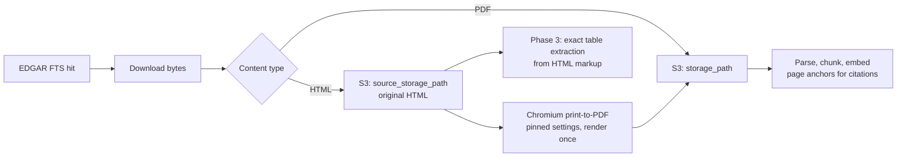

# Phase 2 + Phase 3 — from unrun code to a testable product

**Historical.** This phase is complete. Remaining ingest, ops, and map work lives in
[phase-4-plan.md](phase-4-plan.md). The “Not built” SEDAR/newswire note below is stale.

Working plan for the next build phase. Scope and architecture source of truth remains
[mining-intel-platform-build-plan.md](../mining-intel-platform-build-plan.md); this document
covers what is left to build, what it costs, and what must be done by hand.

## Status

- [x] **Step 1 — Bring-up and environment**
- [x] **Step 2 — Fix EDGAR ingestion** (HTML exhibits render to PDF; OCR spend bounded)
- [x] **Step 3 — Chat: streaming, tools, history**
- [x] **Step 4 — Citations you can click**
- [x] **Step 5 — Structured extraction** (cost-controlled, two-tier)
- [x] **Step 6 — Product surface** (review queue, profiles, three dashboards)

Neon, AWS S3, Anthropic, and Voyage are live. Autoscale floor is **0.25 CU**. Ten migrations are applied. Nine EDGAR SK-1300 filings are indexed; extraction jobs are enqueued after parse.

## Where the project stands

**Complete**
- Phase 0 foundation: monorepo, dbmate migrations covering every table in §4 (`raw`, `sedar`,
  `core`, `app`), HNSW + tsvector GIN indexes, auth shell, Terraform S3/IAM stub.
- Phase 1 workers: [edgar_poller.py](../workers/edgar_poller.py) and
  [processor.py](../workers/processor.py) — search, dedupe, render, parse, chunk, embed.
- Admin surface at [admin/page.tsx](../apps/web/src/app/\(app\)/admin/page.tsx) with per-source
  stats and retry controls.
- Documents corpus browser, pdf.js viewer, and S3 byte-range file route.
- Streaming chat with `search_documents`, `get_document`, and `query_database`; persisted
  history; citation chips that open `/documents/[id]?page=`.
- Database live on Neon: 10 migrations applied, pgvector 0.8.6, both retrieval indexes built.

**Not built**
- No SEDAR+ module, no newswire poller (Phase 4, out of scope here).

## Ingestion artifact model

EDGAR files SK-1300 technical report summaries as HTML exhibits, not PDFs. Citations point at
page numbers, so HTML is rendered once to PDF and that PDF becomes the citable artifact, while
the original markup is retained because its `<table>` structure is exact.

Never re-render a stored document. Page anchors are only valid against the exact render that
produced them; a different Chromium build repaginates and silently invalidates every citation.
`render_engine` on `raw.documents` records what produced each artifact.

## Completed work

### Step 1 — Bring-up and environment

- Added [apps/web/.env.example](../apps/web/.env.example) documenting every web variable.
- Made auth optional in local dev: [proxy.ts](../apps/web/src/proxy.ts) skips protection when
  no Clerk publishable key is present, so the app runs before any account exists. Also renamed
  from `middleware.ts`, which Next 16 deprecated in favour of the `proxy` convention.
- Switched embeddings from `voyage-3` to `voyage-4`: same $0.06/M price, but 200M free tokens
  and a 1024-dim default, so `vector(1024)` and the HNSW index were unchanged. Done before any
  ingestion, since changing later means re-embedding the corpus.
- Installed toolchain (`pnpm`, `uv`, `dbmate`), both dependency trees, and applied migrations.

### Step 2 — Fix EDGAR ingestion

- Migration adding `source_storage_path`, `source_content_type`, `render_engine`.
- [common/render.py](../workers/common/render.py): Chromium print-to-PDF with pinned paper size,
  margins, and scale, documented as a contract rather than preferences.
- [common/s3.py](../workers/common/s3.py) generalized to content-type-aware `upload_object` /
  `download_object`.
- SIC now read from the search response rather than a second request per hit.
- Chromium enabled in [workers/Dockerfile](../workers/Dockerfile).

Three bugs surfaced only by testing against a live filing (a 49-page Odyssey Marine SK-1300
report), each worth recording:

1. **Section detection was entirely broken, and it was the expensive one.** PyMuPDF's text
   output contains no blank lines, so splitting pages on `"\n\n"` produced one block per page
   and heading detection only ever saw a page's first line — zero sections detected on a real
   report. Since section targeting is the 10x extraction cost lever, this would have quietly
   turned a $175 backfill into $2,600. Switching to PyMuPDF layout blocks took section coverage
   from 0% to 100%. The heading regex was also widened from "Item 14" only to Roman numerals
   and decimal numbering, since technical reports use all three conventions.
2. **The SIC filter rejected a genuine technical report.** That filing is coded SIC 4400, outside
   the 1000–1099 mining range. An EX-96 exhibit exists only because of SK-1300, which applies
   only to mining registrants, so exhibit type now overrides SIC.
3. **EDGAR returns intermittent 500s.** One appeared mid-test on a request that succeeded moments
   later. Requests now retry with backoff on 5xx and fail fast on 4xx.

## Step 3 — Chat: streaming, tools, history (done)

- Add `ai` + `@ai-sdk/anthropic` (verify Next 16 compatibility at install; see
  [AGENTS.md](../apps/web/AGENTS.md) and `node_modules/next/dist/docs/`).
- Rewrite [api/chat/route.ts](../apps/web/src/app/api/chat/route.ts) as `streamText` with the
  three §5.4 tools: `search_documents` (wrapping the existing `hybridRetrieve`, plus
  company/doc_type/date filters), `query_database`, and `get_document`.
- `query_database` safety: whitelisted `core.*` views only, run inside
  `BEGIN; SET TRANSACTION READ ONLY;` with a `statement_timeout`, under a least-privilege role.
- Persist history: lazy-upsert `app.users` from the Clerk user id, write `app.chats` /
  `app.chat_messages` with `citations` jsonb, chat list in the sidebar. With auth off locally,
  fall back to a fixed `local-dev` user so history still works.

## Step 4 — Citations you can click (done)

Citation chips open `/documents/[id]?page=` via the same-origin file stream (not a presign redirect).

- `api/documents/[id]/url/route.ts` returning an S3 presigned URL.
- pdf.js viewer opening at a given page; citation chips in
  [chat-client.tsx](../apps/web/src/components/chat/chat-client.tsx) become buttons opening it.
- Replace the `/documents` placeholder with a filterable corpus browser using the same viewer.

## Step 5 — Structured extraction (cost-controlled)

- `workers/common/claude.py`: Anthropic client with JSON tool schemas, Batch API submission,
  prompt caching on system prompt and tool schemas, per-document token-cost logging.
- `workers/extractor.py`: claims `extract` jobs, maps sections from
  `document_chunks.section_title`, sends only relevant sections, validates with pydantic
  (tonnes > 0, plausible grades, sane units), writes rows with `document_id` provenance and
  `extraction_confidence`.
- **Entity resolution comes first.** `core.resource_estimates.project_id` is `NOT NULL`, so
  company (by `cik`) and project must be resolved before any fact rows. Ambiguous matches go to
  review rather than creating duplicate projects.
- **Deterministic table parsing before any LLM call.** HTML-origin filings retain real `<table>`
  markup, so a plain parser handles well-formed resource tables at zero token cost.
- **Model tiering, applied narrowly.** Haiku 4.5 for classification, routing, QP names, drill
  tables; Sonnet 5 for resource and economics tables. The price gap is only 2x, so accuracy
  wins on anything numeric.
- **Skip near-duplicates.** `sha256` misses amended reports and dual-listed companies filing to
  both SEDAR+ and EDGAR. Match on company + project + effective date plus chunk-hash overlap.
- Only technical reports get structured extraction. 10-K/10-Q/press releases are parse-and-embed
  only — chat still answers from them, but they add nothing to the screener.

### Two-tier extraction: triage everything, extract on demand

Corpus ownership is never lazy. Every document is downloaded, stored in versioned S3, recorded,
parsed, chunked, and embedded — 100% coverage, unconditionally. Only numeric extraction defers.

**Tier 1 — triage, every document.** Haiku 4.5 reads the title and first ~2 pages for company,
project, doc type, and a one-line summary. Roughly $0.002–0.005 per document, under $50/year at
18,000 filings. For EDGAR the company comes free from the CIK.

This tier exists because change detection would otherwise break: `core.project_events.project_id`
is `NOT NULL` and project identity is resolved during extraction, so without triage an
unextracted filing produces no event and the Watchlist feed sits empty.

**Tier 2 — full extraction, on demand.** Auto-extract newest technical reports and watchlist
companies. Extract on first view for everything else, so cost follows real usage. Everything
else waits indefinitely — chat and search already work over the full corpus from embeddings; the
only deferred capability is numeric screener filtering.

### Cost ledger and hard caps

- Migration for `app.extraction_costs`: document, model, token counts, computed USD, timestamp.
- Daily and monthly dollar caps in [common/config.py](../workers/common/config.py), checked
  before claiming a job so the worker stops cleanly instead of surprising you.
- `--dry-run` estimating token cost for a queued batch without calling the API.
- Spend-to-date and queue depth surfaced on the admin page.

## Step 6 — Product surface

- `/admin/review`: low-confidence and unreviewed rows with approve/edit/reject.
- `/projects/[id]` and `/companies/[id]` profiles, plus a real `/companies` index.
- Shared components: project card, resource table, economics table, event feed item.
- Screener (saved filters, comparison table, CSV export), Watchlist (`app.watchlists` CRUD +
  `project_events` feed), Research (recent filings, drill highlights, aggregates).
- **Defer the map.** Extraction will not reliably yield lat/lng; the map belongs with the
  MinFile/USGS enrichment in Phase 4.

## Cost model (verified August 2026)

Rates: Sonnet 5 $2/M input, Haiku 4.5 $1/M, Batch API 50% off, cached reads 10% of base,
`voyage-4` $0.06/M with 200M free, Textract DetectDocumentText $1.50/1,000 pages. Sonnet 5's
newer tokenizer produces ~30% more tokens than earlier models, so add roughly a third.

Assuming 5,000 technical reports averaging 200k tokens each:

- **Embeddings, full corpus: ~$60 one-time.** Cheap enough that retrieval quality should never
  be traded away to save here.
- **Extraction, naive:** whole documents to Sonnet 5, ~$2,600 — the §11 estimate.
- **With section targeting:** 200k tokens becomes ~20k, 10x → ~$260.
- **Plus Batch API:** ~$130.
- **Plus lazy extraction:** only the ~500 reports that matter now → **~$20**.
- **Full backfill, if ever wanted:** ~$175 with all optimizations.
- **Steady state after backfill: ~$5/month.**
- **Triage pass: under $50/year** for full change-detection coverage.

Owning the corpus is cheap: ~75 GB of PDFs in versioned S3 is ~$2/month, and the fully embedded
corpus (~1.25M chunks, ~15–20 GB with the HNSW index) is ~$6/month at Neon's $0.35/GB-month.

**Watch Neon compute, not storage.** The always-on processor polls every 5 seconds, defeating
scale-to-zero and metering compute around the clock — ~$77/month at 1 CU, more than every other
line item combined. An autoscale floor of 0.25 CU brings that to ~$19/month.

The multiplier that matters most is section targeting, and it depends on the section map coming
from parsed document structure — never from asking the LLM to locate sections first.

## Manual checklist

Only account creation is genuinely manual; anything that is a shell command is automated.

**Blocking — needs a browser and a credit card:**
- ~~**Neon**~~ — done. All 9 migrations applied, pgvector 0.8.6, retrieval indexes live.
  Autoscale floor is **0.25 CU**.
- ~~**AWS**~~ — S3 corpus is in use for the indexed EDGAR filings. Textract remains optional
  (`OCR_BACKEND=textract`) for scanned pages.
- ~~**Anthropic** and **Voyage**~~ — keys and billing are in use (chat + embeddings).
- A real contact email for `EDGAR_USER_AGENT`; the SEC blocks requests without one.

**Deferred:** Clerk. Local dev runs unauthenticated; create the app before deploying publicly.

**Before Step 5:** set extraction caps (suggested $5/day, $50/month to start).

## When you can see it work

- **After Step 2** — run `uv run python edgar_poller.py --limit 5`, then
  `uv run python processor.py --once`, then `pnpm dev` and open `localhost:3000` (no sign-in).
  Admin shows real documents reaching `indexed`; `/chat` answers cite a genuine SEC filing.
  This is the demo moment from §12 of the build plan. *(Needs AWS + Voyage + Anthropic keys.)*
- **After Step 4** — clicking a citation opens the source document at that exact page. Done:
  chips in chat link to `/documents/[id]?page=`.
- **After Step 5** — a project page shows resources and NPV/IRR traceable to their source.
- **After Step 6** — the screener ranks projects and the watchlist feed fills. Full end-to-end
  testing starts here.
